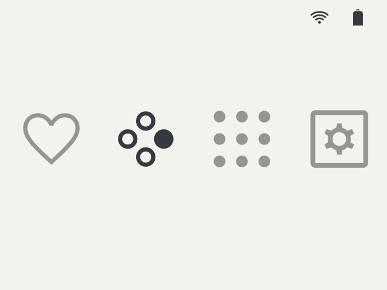
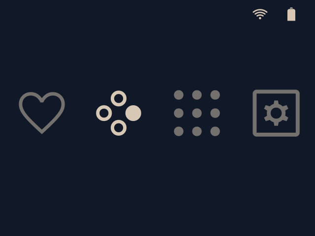
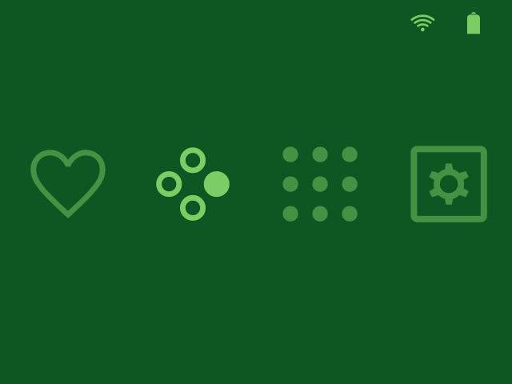
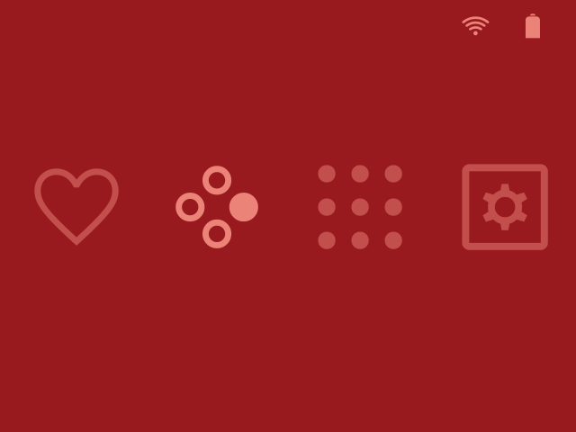
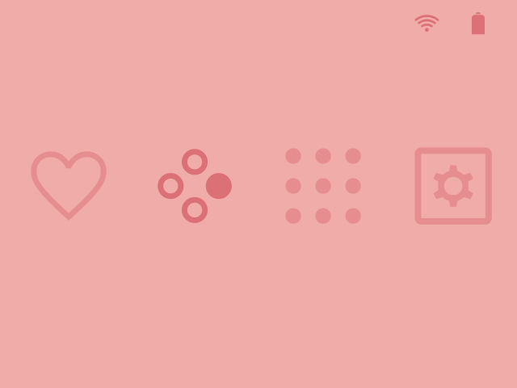
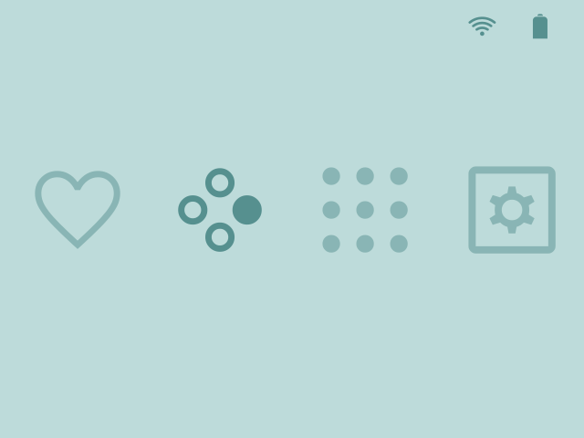

# Project description

This project is a theme builder for SpruceOS. It can support multiple frontends and could be modified to work with OnionOS.
Put your theme files in `projects/themes` and your icon packs in `projects/icon-packs`.
For each theme, you can add as many color variants as you want in `theme-name/palettes`.

Once you have a theme, an icon pack for your emulators and app and a few palettes, you can build any combination you want with the builder.
So, you can work on a dark theme, add a brighter version, a colorful version or any other variant very easily.

# Preview

| **Snowy Peak**<br><br><br><br>`node build-theme example-theme spruceos example-pack --palette snowy-peak` | **Autumn Nights**<br><br><br><br>`node build-theme example-theme spruceos example-pack --palette autumn-nights` |
| :------------ | :------------ |
| **Emerald Green**<br><br><br><br>`node build-theme example-theme spruceos example-pack --palette emerald-green` | **Ruby Red**<br><br><br><br>`node build-theme example-theme spruceos example-pack --palette ruby-red` |
| **Pink Pearl**<br><br><br><br>`node build-theme example-theme spruceos example-pack --palette pink-pearl` | **Blue Pearl**<br><br><br><br>`node build-theme example-theme spruceos example-pack --palette blue-pearl` |

# How to install

```bash
npm install
```

# How to use

```bash
node build-theme <theme-name> <frontend-name> <icon-pack-name>
```

By default, the builder will generate every palette variants.
You can find the result in `builds/`.

Example:

```bash
node build-theme example-theme spruceos example-pack
```

With optional 720p assets:

```bash
node build-theme example-theme spruceos example-pack --720p
```

Build a single palette:

```bash
node build-theme example-theme spruceos example-pack --palette snowy-peak
```

Options can be combined:

```bash
node build-theme example-theme spruceos example-pack --palette snowy-peak --720p
```
